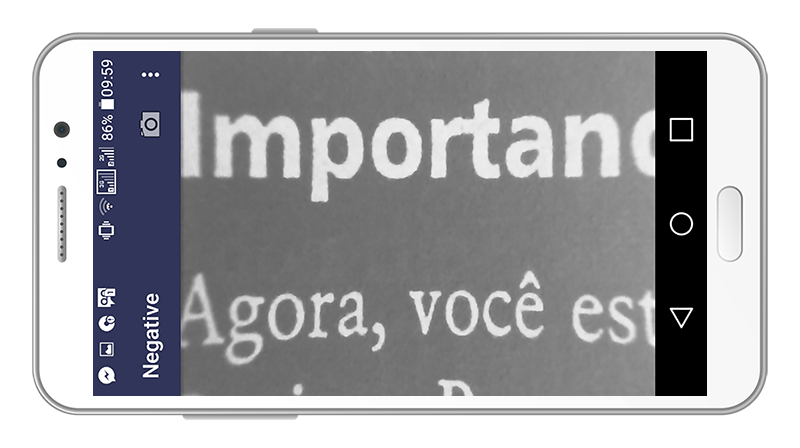
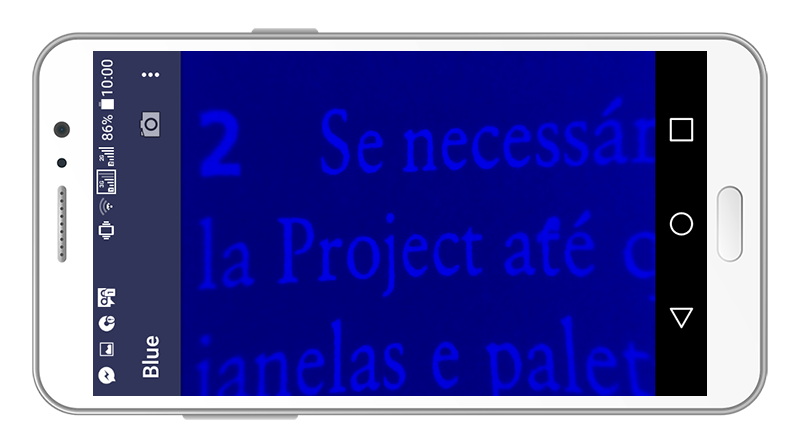
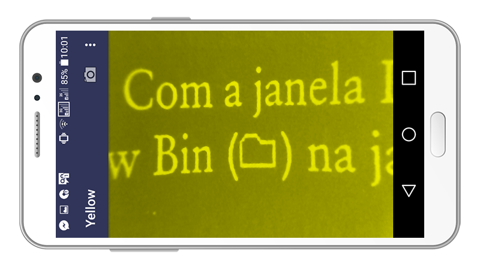
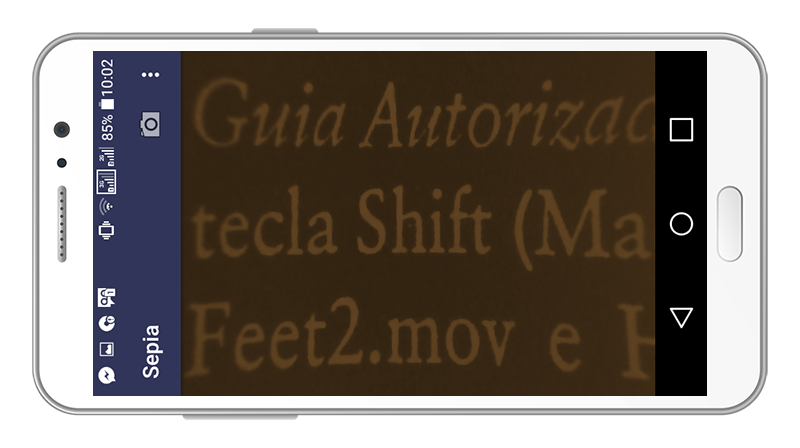

# App Zoom Case 

 The app made based on app named Camera Filter in Android Studio of the startup Zoom Case. The project is a realtime camera filters. That has process frames by OpenGL shaders. 

## Filters

Thanks to the original author of Blueorange (https://www.shadertoy.com/view/MslGzr), that was used to generate all of our filters. The original app Camera Filter had portted them from webgl to opengl es.

| Filter | Preview | Filter | Preview |
| :----- | :------ | :----- | :------ |
| [Negative] |  | [Blue] | |
| [Yellow] | | [Sepia] |  |

## Instalation

To install the Zoom Case app-zoom-case.apk file, follow the steps below:
1. Copy the Android file "app-zoom-case.apk" to SD card or internal storage of your smartphone device.
2. Look in the settings for the device security options and check the box "Unknown sources".
3. To manually install "app-zoom-case.apk" file on your Android device, in the file manager, look for the app-
zoom-case.apk ", just after clicking the file" app-zoom-case.apk "to open and click" install. "

## Operation

To run the program, simply open the Zoom Case application, where the application has a side flap with various textures
(negative, yellow, blue and sepia), where clicking on the names of each texture will give the user the most pleasant way to read,
depending on the user's needs.

## Reference

This app uses the following open-source apps under Apache 2.0 License:

Camera Filter [Github] (https://github.com/nekocode/CameraFilter)

